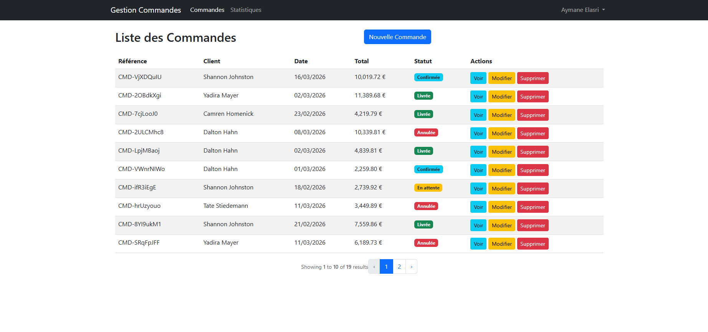
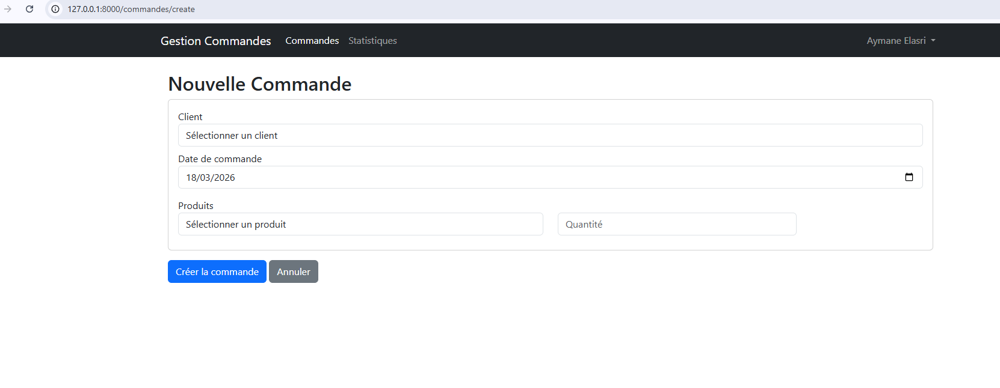
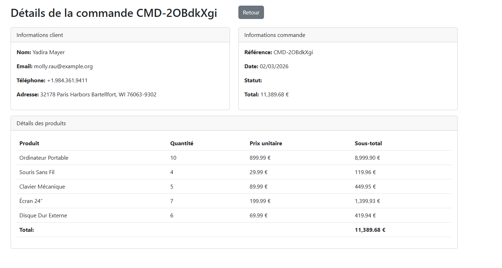
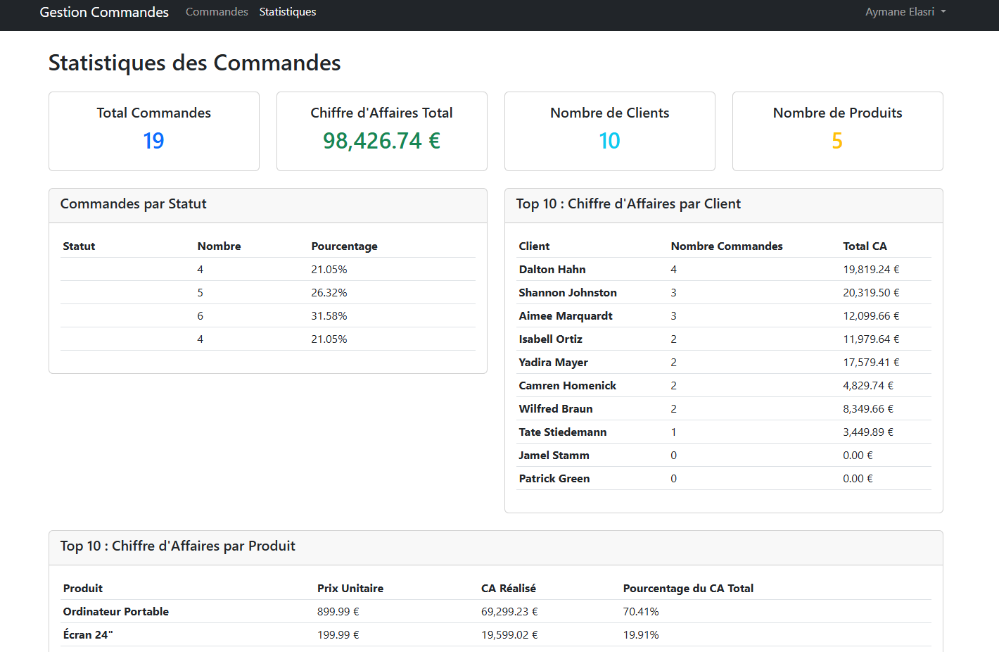

# Gestion  Commandes

Application web de gestion des commandes clients développée avec **Laravel 10** et **Bootstrap 5**.

---

## 🚀 Fonctionnalités principales
- 🔐 Authentification sécurisée (inscription / connexion) avec Laravel Breeze
- 🛒 Gestion des commandes : création, affichage, modification, suppression
- 📦 Gestion du stock produits : décrémentation automatique lors des commandes
- ➕ Ajout de produits à une commande existante
- ✅ Confirmation avant suppression
- 📊 Statistiques : commandes par client, chiffre d’affaires par produit, répartition par statut
- 📑 Pagination élégante avec Bootstrap 5

---

## ⚙️ Stack technique
| Couche       | Technologie          |
|--------------|----------------------|
| Backend      | PHP 8.2 / Laravel 10 |
| Frontend     | Bootstrap 5 (CDN)    |
| Base de données | MySQL (XAMPP)     |
| Authentification | Laravel Breeze   |

---

## 🗂️ Structure de la base de données

clients
  id, nom, prenom, email, telephone, adresse

produits
  id, nom, description, prix, stock

commandes
  id, reference, client_id, date_commande, statut, total

details_commandes
  id, commande_id, produit_id, quantite, prix_unitaire, sous_total

Statuts possibles : `en_attente`, `confirmee`, `livree`, `annulee`

---

## 📥 Installation

### Prérequis
- PHP 8.2+ (XAMPP recommandé)
- Composer
- Node.js & npm
- MySQL

### Étapes
1. Cloner le projet :
   ```bash
   git clone https://github.com/ton-compte/gestion-commandesPro.git
   cd gestion-commandesPro
2. Installer les dépendances :
      ```bash
     composer install
     npm install && npm run dev

3. Configurer l’environnement :
      ```bash
     cp .env.example .env
     php artisan key:generate
4. Lancer les migrations et seeders :
      ```bash
     php artisan migrate --seed
5. Démarrer le serveur :
      ```bash
     php artisan serve
Accéder à http://127.0.0.1:8000

## Routes principales

| Méthode | URL | Description |
|---|---|---|
| GET | /commandes | Liste des commandes |
| GET | /commandes/create | Formulaire création |
| POST | /commandes | Enregistrer commande |
| GET | /commandes/{id} | Détail commande |
| GET | /commandes/{id}/edit | Formulaire modification |
| PUT | /commandes/{id} | Mettre à jour |
| DELETE | /commandes/{id} | Supprimer |
| GET | /commandes/{id}/confirm-delete | Confirmation suppression |
| POST | /commandes/{id}/add-products | Ajouter un produit |
| GET | /statistiques | Page statistiques |

## 🔒 Sécurité
Routes protégées par authentification

Validation des formulaires

Protection CSRF

Gestion des transactions pour l’intégrité des données

Contrôle des stocks avant validation

## Performances
Requêtes optimisées avec Eloquent

Pagination pour les longues listes

Chargement des relations avec with()

Cache des données statiques  

# Page de connexion


Interface d'authentification avec email et mot de passe  
Option "Se souvenir de moi"  
Lien d'inscription pour les nouveaux utilisateurs

# Liste des commandes


Tableau paginé des commandes (10 par page)  
Affichage des références, clients, dates, totaux et statuts  
Badges colorés selon le statut  
Actions (Voir, Modifier, Supprimer)  
Pagination Bootstrap 5

# Création de commande


Formulaire de création avec sélection client  
Date de commande pré-remplie  
Sélection des produits avec contrôle des stocks  
Calcul automatique du total

# Détails de commande


Informations client complètes  
Détails de la commande  
Liste détaillée des produits avec quantités et prix  
Calcul des sous-totaux et du total  
Bouton de retour

# Statistiques


KPIs principaux (total commandes, CA, clients, produits)  
Répartition par statut avec pourcentages  
Top 10 clients par chiffre d'affaires  
Top 10 produits avec part du CA total  
Visualisation des performances


e en pourcentages

Top clients : classement par CA

Top produits : classement avec part du CA total


## Auteurs
Ennouari Fatima
